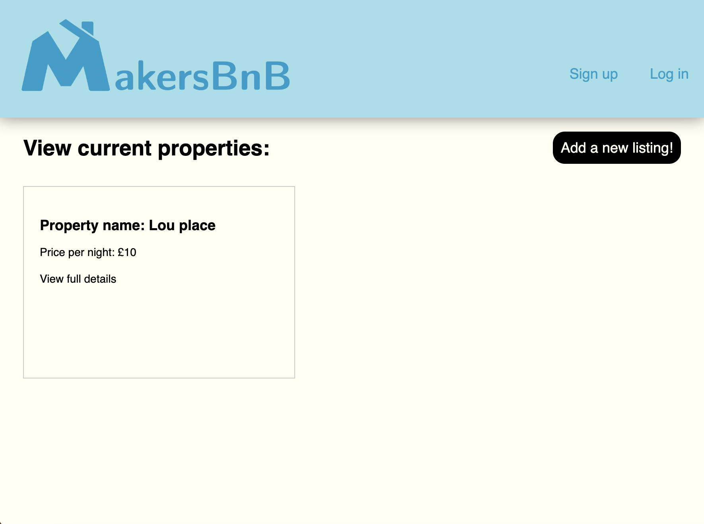

# MakersBnB

## Overview
This is our first group engineering project at Makers Academy. It is an AirBnb style website using Ruby's Sinatra library and my first complete web application.
It's functionality includes:
- Signing up
- Logging in
- Creating a property listing
- Adding dates to listings
- Making booking requests for single dates
- Viewing requests on your own properties
- Confirming a booking for a single date

<br>
<br>

<br>
<br>

## Approach

Design notes and the agile process over the 6 days (Friday - friday)


## Running the program

```bash
# Clone this repository
git clone https://github.com/lplclaremont/makersbnb
cd makersbnb

# Create the production and test databases
createdb makersbnb
createdb makersbnb_test
# Add the tables
psql -h 127.0.0.1 makersbnb < spec/seeds/main_seeds.sql

# Install gems
bundle install

# Run the tests
rspec

# Run the server (better to do this in a separate terminal).
rackup
```
Visit http://localhost:9292/ in your browser.
Now you can create an account and login. From here you are able to make a listing and then add dates to it from your acccount page! An additional feature is that you can view your 'account settings' and from here update your username, email address or password.

## User passwords for testing
- Shrek, fiona_lover420
- Fiona, save_me9001
- Donkey, lust_for_dragons
