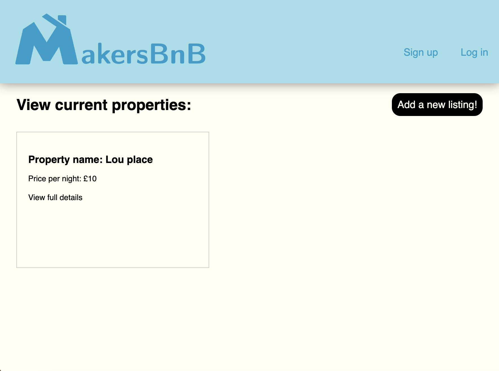

# MakersBnB

## Overview
This is our first group engineering project at Makers Academy. It is an AirBnb style website using Ruby's Sinatra library and my first complete web application.
It's functionality includes:
- Signing up
- Logging in
- Creating a property listing
- Adding dates to listings
- Making booking requests for single dates
- Viewing requests on your own properties
- Confirming a booking for a single date

Below is a view of the landing page

<br>
<br>



<br>
<br>

## Approach

Design notes and the agile process over the 6 days (Friday - friday)
We had 6 total work days for this project, of which we allocated the first to planning and preparation.
Designing database structures, classes and a minimum viable product together was key to ensuring every group member was comfortable and confident that they understood what we were building towards.

We then set out to create appropriate tickets for the tasks (based on user stories) and planned for two sprints, each lasting two days. Our mornings began with stand up meetings and the sprints ended with a retro to assess our progress and work approach.

We maintained thorough testing throughout and did not make any pull request submittions without ensuring that the tests were updated to match the high quality of the code for new features.

Below is the rspec coverage report

<br>
<br>


<br>
<br>

## Running the program

```bash
# Clone this repository
git clone https://github.com/lplclaremont/makersbnb
cd makersbnb

# Install required gems
bundle install

# Create the production and test databases
createdb makersbnb
createdb makersbnb_test
# Add the tables
psql -h 127.0.0.1 makersbnb < spec/seeds/main_seeds.sql


# Run the tests
rspec

# Run the server (better to do this in a separate terminal).
rackup
```
Visit http://localhost:9292/ in your browser.
Now you can create an account and login. From here you are able to make a listing and then add dates to it from your acccount page! An additional feature is that you can view your 'account settings' and from here update your username, email address or password.
